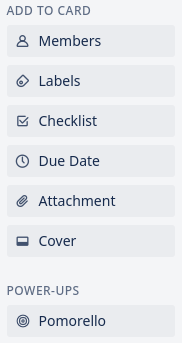
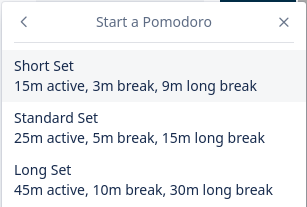
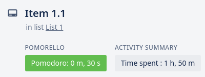

# Pomorello

Pomorello is a light Trello Power-Up for tracking Pomodoro sets.

## Usage

Pomorello is currently under active development.
Upon initial release, it will (hopefully) be available as a Power-Up within Trello.

To use Pomorello, first add it to the board's list of Power-Ups

Next, select the card you want to work on, and click the Pomorello button.

Finally, select the option corresponding to your preferred settings, and watch the magic happen.

That's it! you're all set to start working.

## Why Pomorello?

Pomorello sets itself apart from other applications because it:
- Is completely free
- Is entirely contained in Trello: no sign-ups, no extra accounts, no external websites
- Is easy to use
- Is open-source and community driven. If you want a feature, you can create an issue or PR to add it yourself.

## TODOs

- Add more options for set lengths
- Add stats display
- Add a logo
- Add sounds
- Add optional clearing of Power-Up data
- Add data export

